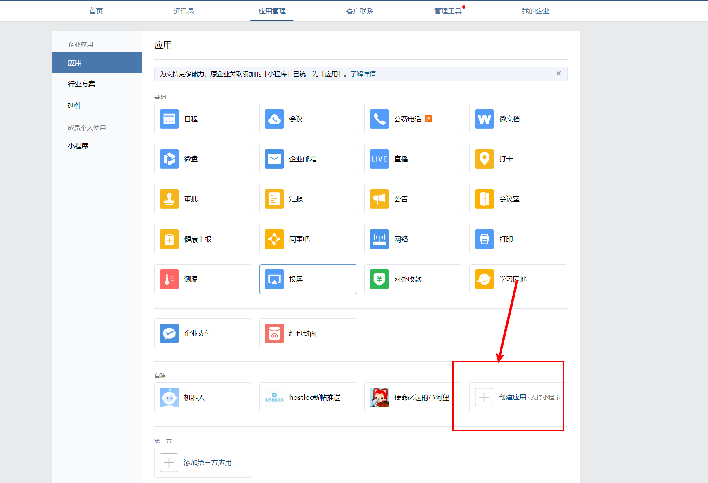
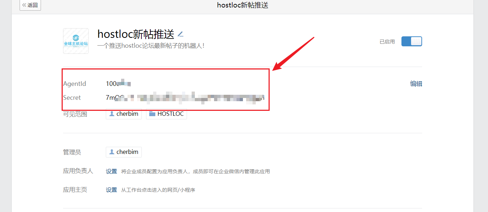
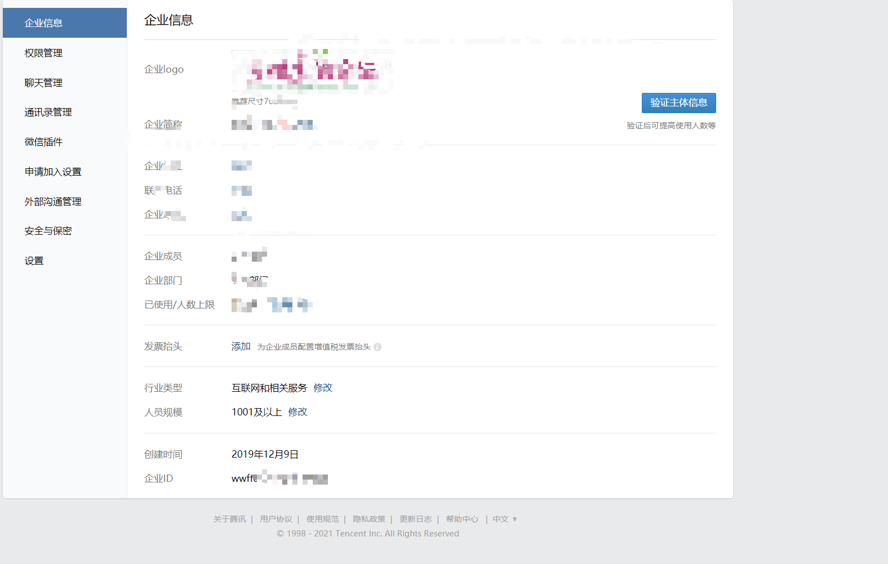

### hostloc新帖推送到微信

#### 说明：

把hostloc最新帖子推送到企业微信(可以通过微信插件在微信接收）

20210212更新：已更新了hostloc新帖api，解决脚本因为论坛开启js验证而失效的问题，api地址：www.cherbim.ml 

使用方法：把hostloc2wechatapi.py上传到服务器，修改wx_url(你自己反代的cf worker地址），然后 nohup python3 hostloc2wechat.py &

#### 简单介绍：

##### 第一种方式：群机器人（webhook）

优点：

1. 可以发送图片，文件，markdown语法，文本

2. 群聊允许500人

缺点：

1. 机器人发送的消息不能超过20条/分钟。

2. 只能内部群（成员必须是你设置的企业成员），不支持外部群

3. **群机器人推送消息微信插件收不到，只能企业微信收得到，但是用户发送信息，微信插件可以收到**（直接放弃此方法）

4. 不能针对单个用户发送信息

文档地址：[如何配置群机器人？-帮助中心-企业微信 (qq.com)](https://work.weixin.qq.com/help?doc_id=13376)

##### 第二种方式：企业微信应用（api）

优点：

1. 可以针对单个用户发送信息
2. 可以发送多种文本，比如文本消息，图片消息，语音消息，视频消息，文件消息，文本卡片消息，图文消息，图文消息（mpnews），markdown消息小程序通知消息(都是垃圾，去年我想封装企业微信推送接口上传到pypi，看文档体验极差）

缺点：

1. 图片每天200张（需上传到企业微信获得media_id然后才能发送）
2. 仅支持post方式提交信息。
3. 企业只能允许200人（高于200需要企业资质认证）

文档地址：[发送应用消息 - 企业微信API (qq.com)](https://work.weixin.qq.com/api/doc/90000/90135/90250)

##### 以下介绍的是企业微信应用（可以微信接信息，无需安装企业微信）： 

第一步：注册企业微信，直接选择微信登录，然后步骤一大堆（自己完善资料，不做过多描述）

第二步：登录网页版企业微信，应用管理，然后找到机器人后面的创建应用，

然后按照提示设置名称，上传图片，创建机器人，点击新创建的机器人（可见范围选择全部企业成员），获得机器人AgentId和Secret，

然后选择我的企业，企业信息，最下面获得企业id，微信插件设置选择打开（微信可以接受企业微信信息）

第三步：修改代码，

修改内容如下：

把代码上传到服务器，首先***安装python3和依赖库requests，lxml***

wx_url地址教程：[w2r/cfworker_WeCom: cf worker反代企业微信接口 (github.com)](https://github.com/w2r/cfworker_WeCom)

修改hostloc2wechat.py第87行的wx_url地址（务必记得地址最后的"/"不能省略）

把脚本上传到服务器，

运行指令： 

~~~
nohup python3 hostloc2wechat.py &
~~~

#### 特殊说明：

​	论坛有时会开启防御模式，强制要求js验证，此时脚本不能爬取网站内容，需要使用 selenium（比较麻烦，需要依赖浏览器），后面再更新使用selenium教程

